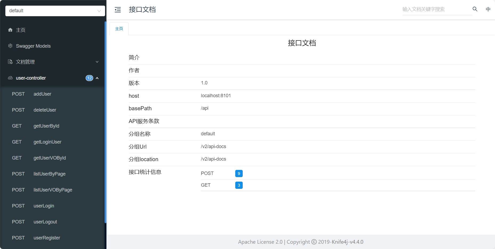

# SpringBoot 项目初始模板

基于 Java SpringBoot 的项目初始模板，整合了常用框架和主流业务的示例代码。

大家还可以在此基础上快速开发自己的项目。

[toc]


## 快速上手

> 所有需要修改的地方都标记了 `todo`，便于大家找到修改的位置~

### MySQL 数据库

1. 修改 `application.yml` 的数据库配置为你自己的：

    ```yml
    spring:
      datasource:
        driver-class-name: com.mysql.cj.jdbc.Driver
        url: jdbc:mysql://localhost:3306/my_db
        username: your_db_username
        password: your_db_password
    ```

2. 执行 `sql/create_table.sql` 中的数据库语句，自动创建库表。

3. 启动项目，访问 `http://localhost:8101/api/doc.html` 即可打开接口文档，不需要写前端就能在线调试接口了~

   

### Redis 分布式登录

1. 修改 `application.yml` 的 Redis 配置为你自己的：

    ```yml
    spring:
      redis:
        database: 1
        host: localhost
        port: 6379
        timeout: 5000
        password: your_redis_password
    ```

2. 修改 `application.yml` 中的 session 存储方式：

    ```yml
    spring:
      session:
        store-type: redis
    ```

3. 移除 `MainApplication` 类开头 `@SpringBootApplication` 注解内的 exclude 参数：

   修改前：

    ```java
    @SpringBootApplication(exclude = {RedisAutoConfiguration.class})
    ```

   修改后：

    ```java
    @SpringBootApplication
    ```


## 配置文件

请参阅`application-example.yml`文件，以了解如何配置您的应用程序。确保在生产环境中使用环境变量或配置管理工具来替代示例中的敏感信息。

### 使用说明

1. 将`application-example.yml`重命名为`application.yml`。
2. 更新数据库、Redis等敏感信息：
    - `datasource.username`：替换为您的数据库用户名。
    - `datasource.password`：替换为您的数据库密码。
    - `redis.password`：如果Redis需要密码，请取消注释并设置您的Redis密码。
3. 根据您的需求调整其他配置。

## 目录结构

- `src/main/resources/application-example.yml`：配置文件示例。
- `src/main/java/com/example/springbootinit`：项目代码目录。

## 注意事项

- 确保配置文件中不包含实际的敏感信息。
- 使用环境变量来管理生产环境中的敏感数据。

